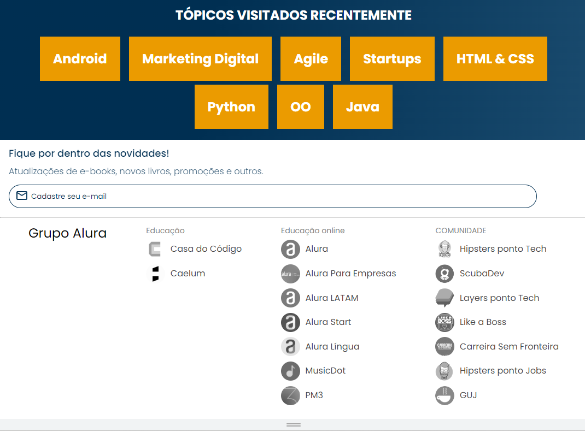
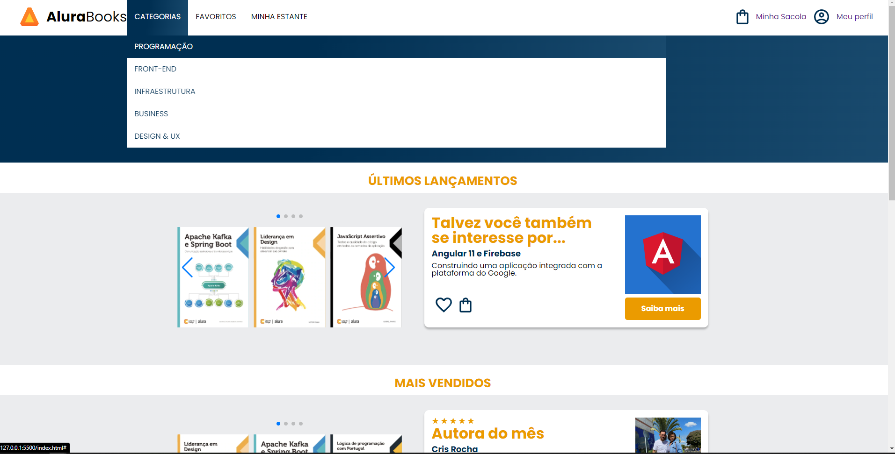
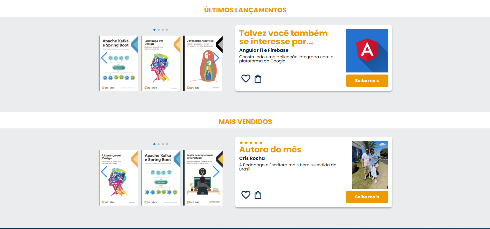

# alurabook
Projeto feito durante o curso de responsividade da Alura


📌 Conteúdo
=================
<!--ts-->
   * [Tecnologias](#Tecnologias)
      * [HTML](#HTML)
      * [CSS](#CSS)
<!--te-->

### Fotos
=================<br>
####Foto da versão mobile
<h1 align="center">
  
</h1>

####Foto da versão do tablet
<h1 align="center">
  
</h1>
####O maior desafio aqui nesta versão foi o footer, onde separamos em três listas, Educação <br>
Educação online e Comunidade. Confira como ficou:
<h1 align="center">
  
</h1>

 ####Também adicionamos cor de fundo e de texto enquanto navegamos pelo menu CATEGORIAS
 <h1 align="center">
  
</h1>

####A estilização do menu se manteve para o computador, e também colocamos a sessão de últimos lançamentos<br>
e o possível interesse do usuário lado a lado, mesma coisa para a sessão dos mais vendidos.
<h1 align="center">
  
</h1>

### 🎲 Executando a Aplicação

```bash
# Clone este repositório
$ git clone https://github.com/frdbrq/alurabook.git
# Execute 
```


### Autor
---

<a href="https://github.com/frdbrq">
 
 <br />
 <sub><b>Fred Buarque</b></sub></a> <a href="https://github.com/frdbrq" title="autor">🚀</a> <br>
